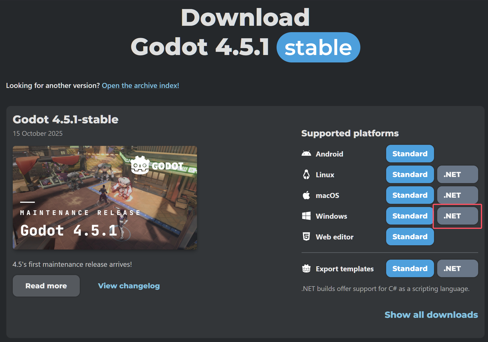
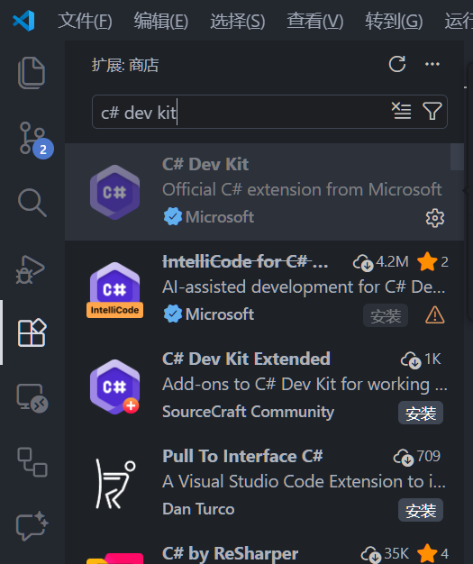
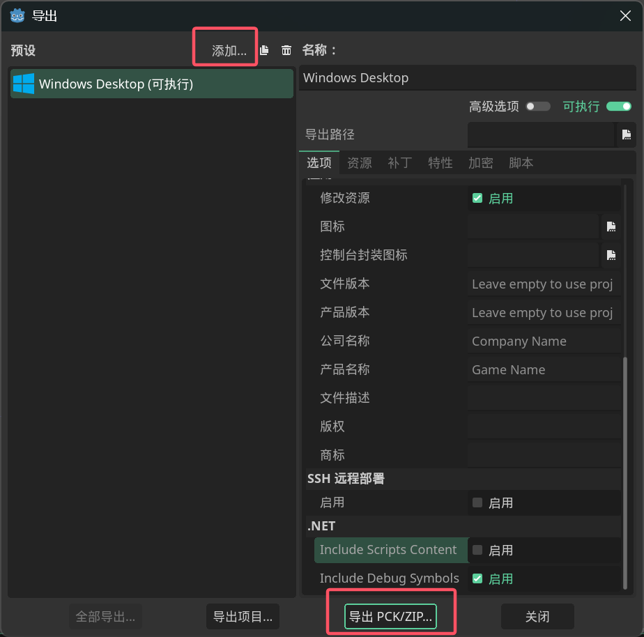

## 环境配置

以下内容仅适用于`0.99`及之后的版本。你需要在steam里切换`public-beta`分支。

以防你有网络问题下载工具：https://pan.baidu.com/s/1yuxPkDpCV8EVLkDubqiirg?pwd=apar

## 其他教程和mod模板

https://github.com/Cany0udance/EarlyStS2ModdingGuides/wiki/Getting-Started-With-Modding

https://github.com/Alchyr/ModTemplate-StS2

https://github.com/freude916/sts2-quickRestart/blob/main/README.md

可以通过`dotnet new install Alchyr.Sts2.Templates`直接安装项目模板，具体查看`ModTemplate-StS2`。

## 安装Godot 4.5.1 Mono

《杀戮尖塔2》是用`Godot4.5.1 Mono`开发的，所以你需要安装`Godot4.5.1 Mono`版本的编辑器。

进入[Godot下载界面](https://godotengine.org/download/archive/4.5.1-stable/)，下载并安装编辑器。注意选择`.NET`版本。


或者，你也可以下载制作组自己使用的Godot修改版本[MegaDot](https://megadot.megacrit.com/)。由于暂不清楚这个版本和官方版本的区别，所以建议直接使用官方版本。

## 安装.NET SDK

下载一个[.NET SDK](https://dotnet.microsoft.com/zh-cn/download)，下载.NET 9以上版本。

## 选择文本编辑器

选择一个文本编辑器。可以使用[Visual Studio Code](https://code.visualstudio.com/)或者[Rider](https://www.jetbrains.com/zh-cn/rider/download/?section=windows)（推荐新手使用Rider）。另外也可以使用 Visual Studio等其他 IDE。以下只介绍 VS Code 的配置方法。

## 安装VS Code插件

安装[C# Dev Kit](https://marketplace.visualstudio.com/items?itemName=ms-dotnettools.csdevkit)。你还可以安装[Godot Tools](https://marketplace.visualstudio.com/items?itemName=geequlim.godot-tools)等插件。



## 参考官方文档

如有问题可以参考Godot的官方文档：[C#开发环境配置](https://docs.godotengine.org/zh-cn/4.x/tutorials/scripting/c_sharp/c_sharp_basics.html)。

## 创建Godot项目

打开`Godot`创建一个新项目。渲染器尽量使用`Mobile/移动`，以和游戏保持一致。


## 创建C#解决方案

点击右上角的“创建C#解决方案”按钮。


## 创建{modid}.json

用`VS Code`打开项目文件夹。创建一个新文件（双击资源管理器或者右键新建文件），名字为`{modid}.json`。`modid`建议和项目名以及其中内容相同。填写以下内容。

```json
{
  "id": "MyMod",           // 必填，唯一 ID，建议和项目名一致
  "name": "我的 Mod",
  "author": "作者名",
  "description": "Mod 描述",
  "version": "1.0",
  "has_pck": true,         // 是否有 .pck 资源包
  "has_dll": true,        // 是否有 .dll 代码
  "dependencies": [""],     // 依赖的其他mod id
  "affects_gameplay": true // 多人模式时是否影响内容，如果是替换模型和优化等不影响内容的mod可填false，默认true
}
```

## 修改.csproj

打开你的`.csproj`文件，<b>*修改*</b>并换成以下内容：

```xml
<Project Sdk="Godot.NET.Sdk/4.5.1">
  <PropertyGroup>
    <TargetFramework>net9.0</TargetFramework>
    <ImplicitUsings>true</ImplicitUsings>
    <LangVersion>12.0</LangVersion>
    <Nullable>enable</Nullable>
    <AllowUnsafeBlocks>true</AllowUnsafeBlocks>

    <!-- 改成你的杀戮尖塔2目录 -->
    <Sts2Dir>D:\xxx\Steam\steamapps\common\Slay the Spire 2</Sts2Dir>
    <Sts2DataDir>$(Sts2Dir)\data_sts2_windows_x86_64</Sts2DataDir>
  </PropertyGroup>

  <ItemGroup>
    <Reference Include="sts2">
      <HintPath>$(Sts2DataDir)\sts2.dll</HintPath>
      <Private>false</Private>
    </Reference>

    <Reference Include="0Harmony">
      <HintPath>$(Sts2DataDir)\0Harmony.dll</HintPath>
      <Private>false</Private>
    </Reference>
  </ItemGroup>

  <!-- 自动复制dll和json -->
  <Target Name="Copy Mod" AfterTargets="PostBuildEvent">
    <Message Text="Copying mod to Slay the Spire 2 mods folder..." Importance="high" />
    <MakeDir Directories="$(Sts2Dir)\mods\" />
    <Copy SourceFiles="$(TargetPath)" DestinationFolder="$(Sts2Dir)\mods\$(MSBuildProjectName)\" />
    <Copy SourceFiles="$(MSBuildProjectName).json" DestinationFolder="$(Sts2Dir)/mods/$(MSBuildProjectName)/" />
  </Target>
</Project>
```

## 创建Entry.cs

创建一个`Scripts`文件夹，创建一个`Entry.cs`文件（两者命名随意，为了整洁美观）。内容改成以下：

> 建议命名空间第一段改成你自己的，不要用`Test`以免后续更改麻烦。另外不要忘记每个文件都加上`namespace`！

```csharp
using Godot.Bridge;
using HarmonyLib;
using MegaCrit.Sts2.Core.Logging;
using MegaCrit.Sts2.Core.Modding;

namespace Test.Scripts;

// 必须要加的属性，用于注册Mod。字符串和初始化函数命名一致。
[ModInitializer("Init")]
public class Entry
{
    // 初始化函数
    public static void Init()
    {
        // 打patch（即修改游戏代码的功能）用
        // 传入参数随意，只要不和其他人撞车即可
        var harmony = new Harmony("sts2.reme.testmod");
        harmony.PatchAll();
        // 使得tscn可以加载自定义脚本
        ScriptManagerBridge.LookupScriptsInAssembly(typeof(Entry).Assembly);
        Log.Debug("Mod initialized!");
    }
}

```

## 构建DLL

按下`ctrl+shift+b`选择`dotnet: build`，或者终端命令行输入`dotnet build`创建dll文件。由于之前`.csproj`文件的配置，dll文件自动复制到游戏根目录的`mods`文件夹里了。

## 导出PCK

回到Godot编辑器，点击项目→导出，点击上方的`添加`一个windows预设，然后

* 点击`导出pck/zip`，把文件名字改成`[项目名].pck`。
* 文件夹选择你之前导出的dll同名目录。
* <b>注意一定得是pck！！！</b>
* 可选：由于现在不需要pck里包含`mod_manifest.json`了，在导出选项里点击`资源`，`从项目中排除文件或目录`，填写`{modid}.json`，`modid`填你自己的，不要写`{modid}`。
- 如果你想支持`0.98`版本，放一个`mod_manifest.json`并打包进pck里。参考：

```json
{
  "pck_name": "test", // 和你的项目名一致
  "name": "Test Mod", // mod 名称
  "author": "Reme", // 作者
  "description": "A mod", // 说明
  "version": "0.0.1" // 版本
}
```




## 了解导出结果

现在你的`mods`文件夹里有一个你的mod命名的文件夹，里面有一个dll文件、一个pck文件和一个json文件，这三个文件是构成一个mod的组件。

* dll文件是mod的代码。如果你没有代码，可以不要。如果你之后改动了代码，只要重新build一下就行。
* pck文件是mod的素材资源。如果你没有素材，可以不要。如果你没有素材上的变动，不需要重新打包一次pck。
* json文件是mod的配置文件，是必须的。

## 运行并验证

运行游戏。第一次会提示是否开启mod，选择是，然后游戏会关闭，打开第二次即可，如果右下角显示“已加载模组”即加载成功。如果发现存档丢失，看下一章。