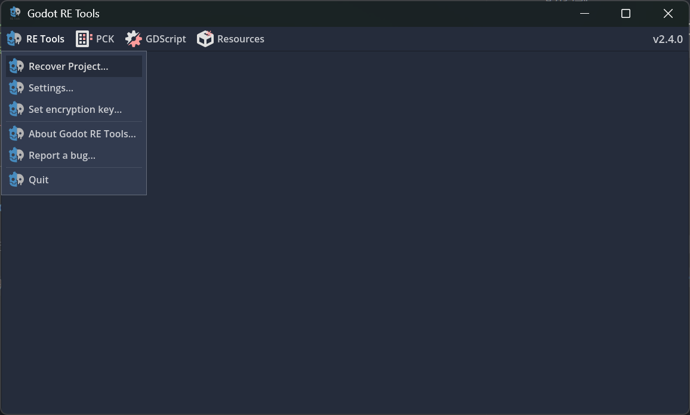
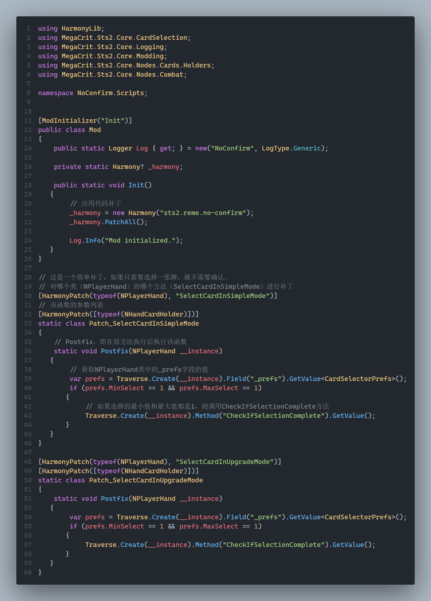
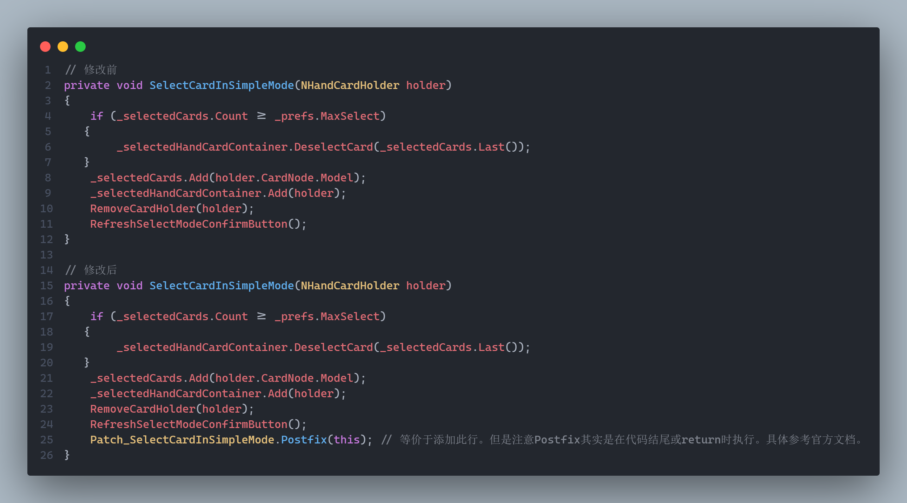

# 安装模组

在尖塔2游戏根目录下的`mods`文件夹里（`xxx\Steam\steamapps\common\Slay the Spire 2\mods`），放置模组提供的`dll`，`pck`和`json`文件各一个。可以套一个文件夹方便管理。

由于尖塔2不安装模组和安装模组的存档是分开的，当你玩模组版时需要复制一份非模组版的存档。

前往`C:\Users\[用户名]\AppData\Roaming\SlayTheSpire2\steam\[你的steamid]`，如果看不到`AppData`在哪问搜索引擎。把`profile1`等复制到`modded`里即可。

# 查看源码

只看源码推荐用ilspy。任选其一：

## gdsdecomp，反编译整个游戏

https://github.com/GDRETools/gdsdecomp

1. 点击右侧`Releases`下载最新版。

2. 打开`gdre_tools.exe`，点击`RE Tools`→`Recover Project...`，选择`xxx\Steam\steamapps\common\Slay the Spire 2\SlayTheSpire2.pck`，点击`Extract`即可。

3. 如果你遇到网络问题，点击`Export Settings...`把`Download Plugins`关了。

4. 等项目导出完，使用godot导入`project.godot`即可。做mod并不需要能在godot里运行这个项目。

## ilspy或dnspy，仅反编译游戏代码

按说明安装[ilspy](https://github.com/icsharpcode/ILSpy)或[dnspy](https://github.com/dnSpy/dnSpy)，然后打开游戏根目录的`data_sts2_windows_x86_64\sts2.dll`即可查看代码。

## 修改代码

使用`Harmony`库进行代码修改，生态位类似于尖塔1的patch。

参考官方文档即可： https://harmony.pardeike.net/articles/basics.html

简单参考：

相当于对源码：

## 控制台

开启了模组，按下`~`（tab上方那个键）即可打开控制台。输入`help`即可查看命令。例如`card SURVIVOR`是把一张生存者加入手中。

你可以查询一个命令的帮助，使用`help card`等。

## DEBUG

尖塔根目录有许多`launch_xxx.bat`，选择一个合适的，右键记事本编辑，在其中加一个`--log`，例如`@echo off
"%~dp0SlayTheSpire2.exe" --log --rendering-driver opengl3 %*`。

然后在根目录创建一个`steam_appid.txt`，里面写`2868840`，然后双击修改的bat文件运行即可以一个能输出log的命令行的方式打开游戏。或者添加`--force-steam=off`参数。

## 本地联机测试

复制出两个新的`bat`，其中一个添加`--fastmp=host`参数，作为主机，另一个添加`--fastmp=join -clientId=1001`参数，作为非主机玩家。当然你可以添加更多，记得修改`clientId`。

如果你打完一层遇到保存问题，记得以管理员模式启动bat。

## 项目改名

<b>以下修改的都建议使用一个名字</b>。

* 打开`project.godot`，修改`config/name`以及`project/assembly_name`。

* 把`{modid}.csproj`的名字修改成你想要的。

* 把`{modid}.json`的名字修改成你想要的。以及里面的`id`部分。

* 把`{modid}.sln`的名字修改成你想要的。

* 然后重新打包。不要忘记把你之前名字的mod删了。