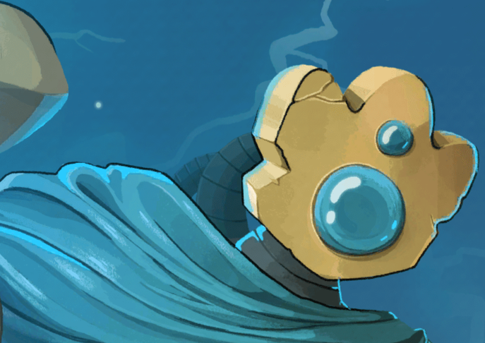
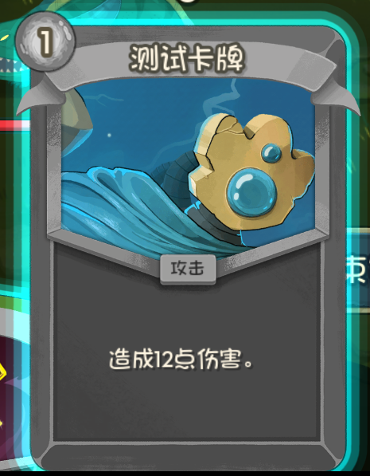
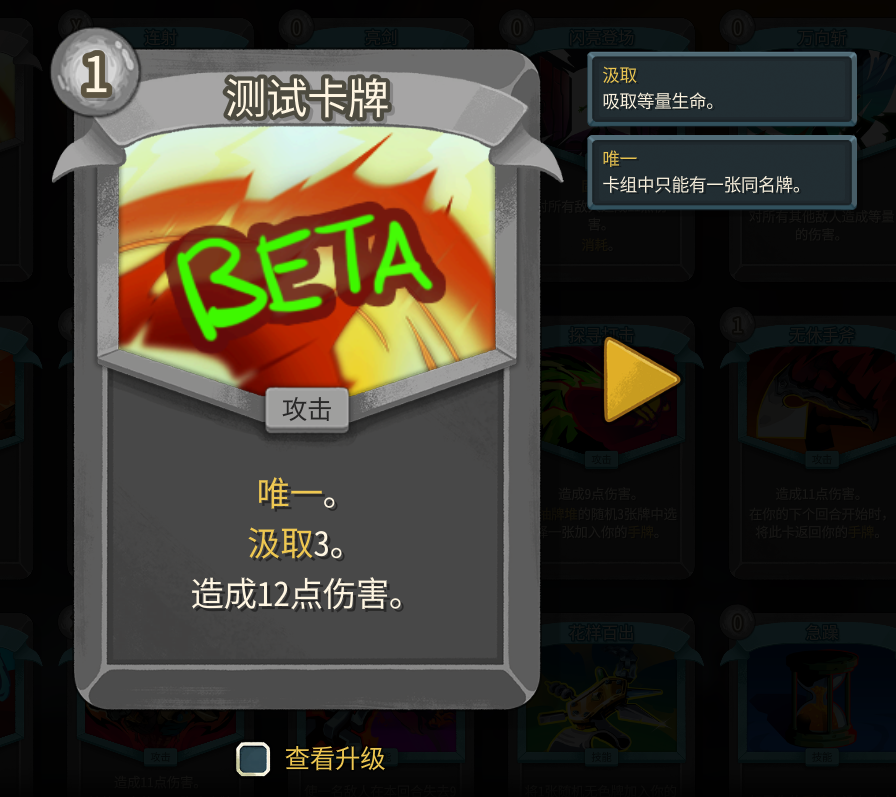
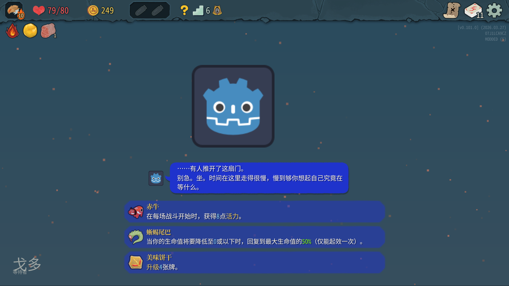
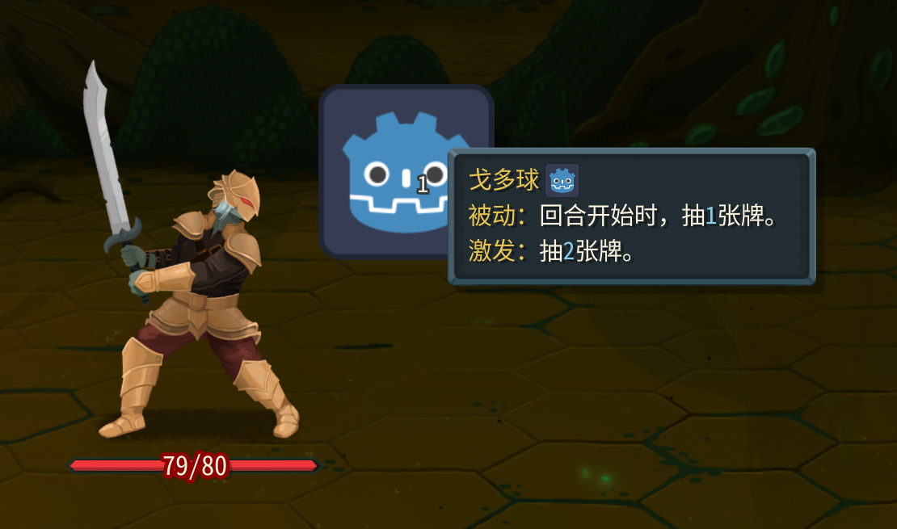

`BaseLib`是统一添加新内容行为的基础mod，类似于塔1的`basemod`和`stslib`。

https://github.com/Alchyr/BaseLib-StS2

> 由于目前`BaseLib`尚处于开发阶段，如果只打patch不添加新内容可以不使用。

## 下载

* 前往 https://github.com/Alchyr/BaseLib-StS2/releases 下载`dll`，`pck`和`json`三个文件，把他们放在`mods`文件夹里。记住你下载的版本。

* 在`csproj`文件中相应位置引用`BaseLib.dll`，如下，两种方式都可。

```xml
  <ItemGroup>
    <Reference Include="sts2">
      <HintPath>$(Sts2DataDir)/sts2.dll</HintPath>
      <Private>false</Private>
    </Reference>

    <Reference Include="0Harmony">
      <HintPath>$(Sts2DataDir)/0Harmony.dll</HintPath>
      <Private>false</Private>
    </Reference>

    <!-- 本地引用，注意路径是否正确 -->
    <Reference Include="BaseLib">
      <HintPath>$(Sts2Dir)/mods/BaseLib/BaseLib.dll</HintPath>
      <Private>false</Private>
    </Reference>
    <!-- NuGet获取，注意版本是否一致，不一致手动更改Version -->
    <!-- <PackageReference Include="Alchyr.Sts2.BaseLib" Version="*" /> -->
  </ItemGroup>
```

* 不要忘了在你`{modid}.json`中填写`dependencies`。

```json
  "dependencies": ["BaseLib"],
```

## 添加新卡牌

### 代码

创建一个新的`Cards`文件夹方便管理，并创建新的`cs`文件，例如`TestCard.cs`。

```csharp
using BaseLib.Abstracts;
using BaseLib.Utils;
using MegaCrit.Sts2.Core.Commands;
using MegaCrit.Sts2.Core.Entities.Cards;
using MegaCrit.Sts2.Core.GameActions.Multiplayer;
using MegaCrit.Sts2.Core.Localization.DynamicVars;
using MegaCrit.Sts2.Core.Models.CardPools;
using MegaCrit.Sts2.Core.ValueProps;

namespace Test.Scripts;

// 加入哪个卡池
[Pool(typeof(ColorlessCardPool))]
public class TestCard : CustomCardModel
{
    // 基础耗能
    private const int energyCost = 1;
    // 卡牌类型
    private const CardType type = CardType.Attack;
    // 卡牌稀有度
    private const CardRarity rarity = CardRarity.Common;
    // 目标类型（AnyEnemy表示任意敌人）
    private const TargetType targetType = TargetType.AnyEnemy;
    // 是否在卡牌图鉴中显示
    private const bool shouldShowInCardLibrary = true;

    // 卡牌的基础属性（例如这里是12点伤害）
    protected override IEnumerable<DynamicVar> CanonicalVars => [new DamageVar(12, ValueProp.Move)];

    public TestCard() : base(energyCost, type, rarity, targetType, shouldShowInCardLibrary)
    {
    }

    // 打出时的效果逻辑
    protected override async Task OnPlay(PlayerChoiceContext choiceContext, CardPlay cardPlay)
    {
        await DamageCmd.Attack(DynamicVars.Damage.BaseValue) // 造成伤害，数值来源于卡牌的基础伤害属性
            .FromCard(this) // 伤害来源于这张卡牌
            .Targeting(cardPlay.Target) // 伤害目标是玩家选择的目标
            .Execute(choiceContext);
    }

    // 升级后的效果逻辑
    protected override void OnUpgrade()
    {
        DynamicVars.Damage.UpgradeValueBy(4); // 升级后增加4点伤害
    }
}
```

* `CanonicalVars`翻译是“规范值”，指卡牌的基础数值。添加一个`DamageVar`意为指定卡牌的基础伤害是多少，例如这里是`12`。

* `ValueProp`表示数值的属性，例如`ValueProp.Move`表示是通过卡牌造成的伤害/格挡，`ValueProp.Unpowered`表示不受修正影响（如力量等），`ValueProp.Unblockable`表示伤害不可被格挡，`ValueProp.SkipHurtAnim`表示跳过受伤动画。这是一个bitflag类型的枚举，你可以进行组合，例如`ValueProp.Unblockable | ValueProp.Unpowered`，不可被格挡也不受修正影响。

* 尖塔2使用了`async`和`await`来控制效果逻辑顺序执行，比如选择一张牌时就一直`await`不让后续代码执行，和尖塔1的`action`类似的生态位。此处的`OnPlay`中写了一个造成单体伤害的指令。

* 想做什么样的卡牌，看原版代码哪张有类似的效果，参考即可。

* 添加一个`Pool`的attribute，并指定要添加的颜色卡池，然后会自动注册。
* 继承`CustomCardModel`而不是`CardModel`。
* <b>注意</b>：通过`baselib`添加卡牌，其id会变成`{命名空间第一段大写}-{原卡牌id}`，例如`namespace Test.Scripts;`取`TEST`，原始卡牌id为`TEST-CARD`，是`TestCard`的大写snake-case，最后变成`TEST-TEST_CARD`。

### 卡图

可以通过在卡牌类中添加一个表达式属性来添加卡牌，这样的话可以任意指定位置：`public override string PortraitPath => $"res://test/images/cards/{Id.Entry.ToLowerInvariant()}.png";`，
如下，那么路径就是`test/images/cards/test-test_card.png`（是你类名的`snake_case`命名风格加前缀，例如`TestCard`即为`test-test_card`）。当然按你的喜好组织资源路径也可。

> 或者你也可以使用`public override string PortraitPath => $"res://test/images/cards/{nameof(TestCard)}.png";`，这样更方便，卡图名字设置为`TestCard.png`就行。

卡图任意尺寸都可，且不需要裁剪，官方使用的尺寸是普通卡1000x760，先古卡606x852。

```csharp
public class TestCard : TestCardModel
{
    private const int energyCost = 1;
    private const CardType type = CardType.Attack;
    private const CardRarity rarity = CardRarity.Common;
    private const TargetType targetType = TargetType.AnyEnemy;
    private const bool shouldShowInCardLibrary = true;

    protected override IEnumerable<DynamicVar> CanonicalVars => [new DamageVar(12, ValueProp.Move)];

    // 添加这一行，指定卡牌立绘路径
    public override string PortraitPath => $"res://test/images/cards/{Id.Entry.ToLowerInvariant()}.png";

    public TestCard() : base(energyCost, type, rarity, targetType, shouldShowInCardLibrary)
    {
    }
}
```



你也可以通过新增一个`abstract`类，避免每张卡都写一遍卡图路径，并且方便管理一些自定义功能。

```csharp
public abstract class TestCardModel : CardModel
{
    public override string PortraitPath => $"res://test/images/cards/{Id.Entry.ToLowerInvariant()}.png";

    public TestCardModel(int energyCost, CardType type, CardRarity rarity, TargetType targetType, bool shouldShowInCardLibrary) : base(energyCost, type, rarity, targetType, shouldShowInCardLibrary)
    {
    }
}

public class TestCard : TestCardModel {}
```

### 文本

此外还需要本地化文件。创建一个`{modId}/localization/{Language}/cards.json`。
* `modId`即为你`{modId}.json`中填写的。<b>不是你的根目录，而是一个新文件夹。</b>
* `Language`可以写`zhs`表示简体中文。填写`{CardId}.title`（卡牌名）和`{CardId}.description`（卡牌描述）：

```json
{
    "TEST-TEST_CARD.title": "测试卡牌",
    "TEST-TEST_CARD.description": "造成{Damage:diff()}点伤害。"
}
```

编译打包`dll`和`pck`后打开游戏。如果你在对应池子中看到卡牌说明成功了。如果没有任何卡牌（或者一张在左上角的卡牌）说明出问题了。

按`~`打开控制台输入`card TEST-TEST_CARD`获得这张卡。



如果报错，回头看看。最终项目结构参考：

```
Test (你的项目文件夹)
├── Scripts (你的脚本文件夹，随意)
│   ├── TestCard.cs
│   └── Entry.cs
└── Test (不要忘了这一层文件夹)
    ├── images
    │   └── cards
    │       └── test-test_card.png
    └── localization
        └── zhs
            └── cards.json
```

## 自定义模组配置

* 要使用此功能，需要先放一张图片到`{modId}\mod_image.png`作为mod图标，尺寸任意，否则会由于报错不显示配置。
* 添加一个继承`SimpleModConfig`（或者是`ModConfig`如果你想要更复杂的设置）的类，在其中添加`public static bool`变量。支持`bool`，`double`，`enum`，`int`，`string`。
* 在初始化函数调用`ModConfigRegistry.Register`。字符串写你的`modId`。

```csharp
[ModInitializer("Init")]
public class Entry
{
    public static void Init()
    {
        ModConfigRegistry.Register("test", new ModConfig());
    }
}

public class ModConfig : SimpleModConfig
{
    public static bool Test1 { get; set; } = true;
    public static bool Test2 { get; set; } = false;
    public static bool Test3 { get; set; } = true;
}
```


更多请参考`baselib`的`BaseLibConfig`类。

## 添加新遗物

和添加卡牌类似。先新建一个类。

```csharp
// 加入哪个遗物池，此处为通用
[Pool(typeof(SharedRelicPool))]
public class TestRelic : CustomRelicModel
{
    // 稀有度
    public override RelicRarity Rarity => RelicRarity.Common;

    // 遗物的数值。替换本地化中的{Cards}。
    protected override IEnumerable<DynamicVar> CanonicalVars => [new CardsVar(1)];

    // 小图标
    public override string PackedIconPath => $"res://test/images/relics/{Id.Entry.ToLowerInvariant()}.png";
    // 轮廓图标
    protected override string PackedIconOutlinePath => $"res://test/images/relics/{Id.Entry.ToLowerInvariant()}.png";
    // 大图标
    protected override string BigIconPath => $"res://test/images/relics/{Id.Entry.ToLowerInvariant()}.png";

    public override async Task AfterPlayerTurnStart(PlayerChoiceContext choiceContext, Player player)
    {
        // 这里的DynamicVars.Cards.IntValue为上面设置的CardsVar的数值。
        await CardPileCmd.Draw(choiceContext, DynamicVars.Cards.IntValue, player);
    }
}
```

然后放一张图片`test/images/relics/test_relic.png`。路径不一定是`test`，组织风格自定义，参考上面卡图部分。这里偷懒三张图片用了一样的，可以自己修改。


然后写一个本地化文件，`{modId}/localization/{Language}/relics.json`。

```json
{
  "TEST-TEST_RELIC.title": "测试遗物",
  "TEST-TEST_RELIC.description": "每回合开始时，抽[blue]{Cards}[/blue]张牌。",
  "TEST-TEST_RELIC.flavor": "觉得很眼熟？"
}
```

## 添加新卡牌关键词

这里的关键词指的是`消耗`，`虚无`一类的卡牌属性，塔2并不需要你在卡牌描述里写这些，只需在`CanonicalKeywords`添加即可。

* 新建一个类：

```csharp
public class MyKeywords
{
    // 自定义枚举的名字。最终会变成{前缀}-{枚举值大写}的形式，例如TEST-UNIQUE
    [CustomEnum("UNIQUE")]
    // 放在原版卡牌描述的位置，这里是卡牌描述的前面
    [KeywordProperties(AutoKeywordPosition.Before)]
    public static CardKeyword Unique;
}
```

* 添加一个本地化文件，`{modId}/localization/{Language}/card_keywords.json`。

```json
{
    "TEST-UNIQUE.description": "卡组中只能有一张同名牌。",
    "TEST-UNIQUE.title": "唯一"
}
```

* 然后在你的卡牌类里添加这一行，或者添加keyword：

```csharp
    public override IEnumerable<CardKeyword> CanonicalKeywords => [MyKeywords.Unique];
```


## 添加动态变量

动态变量是指`伤害`，`格挡`，`抽牌数`，`获得能量数`等这种动态数值。虽然可以通过`new DynamicPower("xxx", 1)`这种形式添加，但是写一个新的类比较规范也便于扩展功能。

通过`baselib`的`WithTooltip`可以添加tooltip。

先创建新的类：
```csharp
using BaseLib.Extensions;
using MegaCrit.Sts2.Core.Localization.DynamicVars;

namespace Test.Scripts;

public class TestDynamicVar : DynamicVar
{
    // 在描述中用作占位符的键，推荐添加前缀避免撞车
    public const string Key = "Test-Leech";
    // 本地化键，这里设置为大写的Key，也就是"TEST-LEECH"
    public static readonly string LocKey = Key.ToUpperInvariant();

    public TestDynamicVar(decimal baseValue) : base(Key, baseValue)
    {
        this.WithTooltip(LocKey);
    }
}
```

然后添加一个新的本地化文件`{modId}/localization/{Language}/static_hover_tips.json`。

```json
{
    "TEST-LEECH.description": "吸取等量生命。",
    "TEST-LEECH.title": "汲取"
}
```

如果要使用这个变量，在卡牌类的`CanonicalVars`中添加你新建的变量即可。

```csharp
    protected override IEnumerable<DynamicVar> CanonicalVars => [
        new DamageVar(12, ValueProp.Move),
        new TestDynamicVar(3)
    ];
```

然后修改卡牌的描述以使用：

```json
{
    "TEST-TEST_CARD.title": "测试卡牌",
    "TEST-TEST_CARD.description": "[gold]汲取[/gold]{Test-Leech:diff()}。\n造成{Damage:diff()}点伤害。"
}
```

`:diff()`表示这个值一旦和基础值不同，就会变红色或绿色（例如升级时增加数值，预览变成绿色）。




当然如果你只是个简单的数值，这样就行：

```csharp
    protected override IEnumerable<DynamicVar> CanonicalVars => [
        new DamageVar(12, ValueProp.Move),
        new DynamicVar("Test-Leech", 1m).WithTooltip("TEST-LEECH")
    ];
```

## 添加卡牌提示文本

指的是卡牌旁出现的提示方框，或预览卡牌。

仅需在卡牌类中重载`ExtraHoverTips`即可：

```csharp
[Pool(typeof(TestCardPool))]
public class TestCard : CustomCardModel
{
    // 其余省略

    // 通过HoverTipFactory添加各种提示文本
    protected override IEnumerable<IHoverTip> ExtraHoverTips => [
        HoverTipFactory.FromCard<Shiv>(),
        HoverTipFactory.FromPower<TestPower>(),
        HoverTipFactory.FromKeyword(MyKeywords.Unique)
    ];
}
```

## 添加局内保存

在卡牌、遗物、附魔、Modifier（每日挑战效果）的`Model`的属性中中添加带`SavedProperty`的属性即可保存。

```csharp
[Pool(typeof(SharedRelicPool))]
public class TestRelic : CustomRelicModel
{
    // 这个属性会被保存。建议添加前缀id防止撞车。
    // 设置不同的SerializationCondition来控制属性的保存条件，例如这里使用默认值AlwaysSave表示无论属性值是什么都保存。
    [SavedProperty]
    public int Test_GameTurns { get; set; } = 0;

    // 添加新的动态变量
    protected override IEnumerable<DynamicVar> CanonicalVars => [new CardsVar(1), new DynamicVar("GameTurns", Test_GameTurns)];

    public override async Task AfterPlayerTurnStart(PlayerChoiceContext choiceContext, Player player)
    {
        // 每回合开始时，修改Test_GameTurns的值，并改变卡牌描述中{GameTurns}的值为Test_GameTurns的值
        Test_GameTurns++;
        DynamicVars["GameTurns"].BaseValue = Test_GameTurns;
        await CardPileCmd.Draw(choiceContext, DynamicVars.Cards.IntValue, player);
    }
}
```

```json
{
  "TEST-TEST_RELIC.title": "测试遗物",
  "TEST-TEST_RELIC.description": "每回合开始时，抽[blue]{Cards}[/blue]张牌。\n已经历过[blue]{GameTurns}[/blue]回合了。",
  "TEST-TEST_RELIC.flavor": "觉得很眼熟？"
}
```

## 添加新能力

新建类：

```csharp
public class TestPower : CustomPowerModel
{
    // 类型，Buff或Debuff
    public override PowerType Type => PowerType.Buff;
    // 叠加类型，Counter表示可叠加，Single表示不可叠加
    public override PowerStackType StackType => PowerStackType.Counter;

    // 自定义图标路径，自己指定，或者创建一个基类来统一指定图标路径
    public override string? CustomPackedIconPath => "res://test/powers/test_power.png";
    public override string? CustomBigIconPath => "res://test/powers/test_power.png";

    // 抽牌后给予玩家力量
    public override async Task AfterCardDrawn(PlayerChoiceContext choiceContext, CardModel card, bool fromHandDraw)
    {
        await PowerCmd.Apply<StrengthPower>(Owner, Amount, Owner, null);
    }
}
```

添加json，`{modId}/localization/{Language}/powers.json`。
```json
{
    "TEST-TEST_POWER.description": "每次抽牌时，获得一点[gold]力量[/gold]。",
    "TEST-TEST_POWER.smartDescription": "每次抽牌时，获得[blue]{Amount}[/blue]点[gold]力量[/gold]。", // smartDescription可以使用{Amount}来显示当前的数值
    "TEST-TEST_POWER.title": "邪火"
}
```

然后使用`PowerCmd.Apply<TestPower>(...)`给予即可。或者使用控制台`power TEST-TEST_POWER 1 0`。


## 添加新怪物
TODO:虽然可以加，但是最好等一个baselib

## 添加新事件
TODO:不方便添加，等一个baselib

## 添加新药水

首先创建类：（很多代码和卡牌类似，参考即可）

```csharp
using BaseLib.Abstracts;
using BaseLib.Utils;
using MegaCrit.Sts2.Core.Entities.Cards;
using MegaCrit.Sts2.Core.Entities.Creatures;
using MegaCrit.Sts2.Core.Entities.Potions;
using MegaCrit.Sts2.Core.GameActions.Multiplayer;
using MegaCrit.Sts2.Core.HoverTips;
using MegaCrit.Sts2.Core.Localization.DynamicVars;
using MegaCrit.Sts2.Core.Models.Cards;

namespace Test.Scripts;

[Pool(typeof(TestPotionPool))]
public class TestPotion : CustomPotionModel
{
    // 稀有度
    public override PotionRarity Rarity => PotionRarity.Common;

    // 使用方式，CombatOnly表示只能在战斗中使用。
    public override PotionUsage Usage => PotionUsage.CombatOnly;

    // 目标类型
    public override TargetType TargetType => TargetType.Self;

    // 定义动态变量
    protected override IEnumerable<DynamicVar> CanonicalVars => [new CardsVar(3)];

    // 这里显示预览卡牌灵魂。或者你可以添加提示关键词
    public override IEnumerable<IHoverTip> ExtraHoverTips => [HoverTipFactory.FromCard<Soul>()];

    public override string? PackedImagePath => "res://icon.svg";
    public override string? PackedOutlinePath => "res://icon.svg";

    // 打出时的效果逻辑，这里是创造3张灵魂到手牌中。
    protected override async Task OnUse(PlayerChoiceContext choiceContext, Creature? target)
    {
        // 这里的DynamicVars.Cards.IntValue就是我们在CanonicalVars中定义的CardsVar的数值，也就是3。
        await Soul.CreateInHand(Owner, DynamicVars.Cards.IntValue, Owner.Creature.CombatState!);
    }
}
```

然后创建`{modId}/localization/{Language}/potions.json`。

```json
{
    "TEST-TEST_POTION.title": "戈多药水",
    "TEST-TEST_POTION.description": "将[blue]{Cards}[/blue]张[gold]灵魂[/gold]加入你的[gold]手牌[/gold]。"
}
```

## 添加新附魔
TODO:虽然可以加，但是最好等一个baselib

## 添加先古之民

> 目前（Baselib 0.2.1）有点小bug（场景路径只能用游戏自带）

首先创建类：

```csharp
using BaseLib.Abstracts;
using BaseLib.Extensions;
using BaseLib.Utils;
using Godot;
using MegaCrit.Sts2.Core.Models;
using MegaCrit.Sts2.Core.Models.Relics;

namespace Test.Scripts;

public class TestAncient : CustomAncientModel
{
    // 选项按钮颜色
    public override Color ButtonColor => new(0.12f, 0.2f, 0.8f, 0.5f);
    // 对话框颜色
    public override Color DialogueColor => new(0.12f, 0.2f, 0.8f);

    // 出现条件。这里是只能在第二幕出现
    public override bool IsValidForAct(ActModel act) => act.ActNumber() == 2;
    // 自定义场景的路径。目前不能使用自定义路径，只能使用"scenes/events/background_scenes/{id}.tscn"这个路径。
    // public override string? CustomScenePath => "res://test/scenes/test_ancient.tscn";
    public override string? CustomScenePath => "res://scenes/events/background_scenes/test-test_ancient.tscn";
    // 自定义地图图标和轮廓的路径
    public override string? CustomMapIconPath => "res://icon.svg";
    public override string? CustomMapIconOutlinePath => "res://icon.svg";
    // 历史记录图标路径
    public override Texture2D? CustomRunHistoryIcon => GD.Load<Texture2D>("res://icon.svg");
    public override Texture2D? CustomRunHistoryIconOutline => GD.Load<Texture2D>("res://icon.svg");

    // 生成选项。每个选项有自己的池子。
    protected override OptionPools MakeOptionPools { get; } = new OptionPools(
        MakePool(
            AncientOption<Akabeko>(),
            AncientOption<Anchor>()
        ),
        MakePool(
            AncientOption<LizardTail>(),
            AncientOption<ArcaneScroll>()
        ),
        MakePool(
            AncientOption<YummyCookie>(weight: 2), // 加权重，权重越高越容易取到
            AncientOption<WingCharm>()
        )
    );
}
```

然后创建`{modId}/localization/{Language}/ancients.json`。已经有的话继续添加内容即可。

此处id为`{命名空间第一段大写}-{类名的大写SNAKE_CASE}`。编写规则参考`先古对话`一章。

```json
{
  "TEST-TEST_ANCIENT.title": "戈多",
  "TEST-TEST_ANCIENT.epithet": "等待者",
  "TEST-TEST_ANCIENT.talk.firstVisitEver.0-0.ancient": "……有人推开了这扇门。\n别急。坐。时间在这里走得很慢，慢到够你想起自己究竟在等什么。",
  "TEST-TEST_ANCIENT.talk.ANY.0-0r.ancient": "不必报名字。排队的人太多，名字会互相踩到。",
  "TEST-TEST_ANCIENT.talk.ANY.1-0r.ancient": "你又来了？门没锁。我也没走。我们只是……还在。",
  "TEST-TEST_ANCIENT.talk.IRONCLAD.0-0.ancient": "战士，你的火太亮。要不要先把它搁在门边，再进来等？",
  "TEST-TEST_ANCIENT.talk.IRONCLAD.1-0r.ancient": "你还在。很好。愤怒也可以等——等累了，就会坐下。",
  "TEST-TEST_ANCIENT.talk.IRONCLAD.2-0.ancient": "你若一定要走……带上这个。不是礼物，是“下次还来”的凭证。",
  "TEST-TEST_ANCIENT.talk.IRONCLAD.2-0.next": "继续",
  "TEST-TEST_ANCIENT.talk.IRONCLAD.2-1.char": "……我收下。但我仍会赶路。",
  "TEST-TEST_ANCIENT.talk.IRONCLAD.2-1.next": "继续",
  "TEST-TEST_ANCIENT.talk.IRONCLAD.2-2.ancient": "很好。赶路的人最需要一种东西：知道自己还会回到某个门口。",
  "TEST-TEST_ANCIENT.talk.SILENT.0-0.ancient": "猎手，我不问你来历。你只要不说话，我们就算谈妥了。",
  "TEST-TEST_ANCIENT.talk.SILENT.1-0r.ancient": "……还在。",
  "TEST-TEST_ANCIENT.talk.SILENT.2-0.ancient": "沉默很贵。你付得起，我就替你留着这把椅子。",
  "TEST-TEST_ANCIENT.talk.SILENT.2-0.next": "继续",
  "TEST-TEST_ANCIENT.talk.SILENT.2-1.char": "……",
  "TEST-TEST_ANCIENT.talk.SILENT.2-1.next": "继续",
  "TEST-TEST_ANCIENT.talk.SILENT.2-2.ancient": "很好。最响的声音，往往是什么都不说。",
  "TEST-TEST_ANCIENT.talk.DEFECT.0-0.ancient": "构装体……滴答声很均匀。像钟。钟最懂等待。",
  "TEST-TEST_ANCIENT.talk.DEFECT.1-0r.ancient": "<平稳的嘀嘀声>",
  "TEST-TEST_ANCIENT.talk.DEFECT.2-0.ancient": "你若在找“被修好”的答案……先学会把问题悬着。悬着，就不会碎。",
  "TEST-TEST_ANCIENT.talk.DEFECT.2-0.next": "继续",
  "TEST-TEST_ANCIENT.talk.DEFECT.2-1.char": "[i][font_size=22]<迟疑的嘀嘀声>[/font_size][/i]",
  "TEST-TEST_ANCIENT.talk.DEFECT.2-1.next": "继续",
  "TEST-TEST_ANCIENT.talk.DEFECT.2-2.ancient": "去吧。带着你的节拍走——别让它催你，让它陪你等。",
  "TEST-TEST_ANCIENT.talk.NECROBINDER.0-0.ancient": "女士，复仇也会排队。你要不要领个号？",
  "TEST-TEST_ANCIENT.talk.NECROBINDER.1-0r.ancient": "号还没叫到你。别急。恨意放得越久，刃口越利。",
  "TEST-TEST_ANCIENT.talk.NECROBINDER.2-0.ancient": "你若一定要见血……至少别让血溅到“还没来”的东西上。",
  "TEST-TEST_ANCIENT.talk.NECROBINDER.2-0.next": "继续",
  "TEST-TEST_ANCIENT.talk.NECROBINDER.2-1.char": "……我会等。等到该清算的那一刻。",
  "TEST-TEST_ANCIENT.talk.NECROBINDER.2-1.next": "继续",
  "TEST-TEST_ANCIENT.talk.NECROBINDER.2-2.ancient": "那就对了。等待不是软弱，是把刀磨到只挥一次。",
  "TEST-TEST_ANCIENT.talk.REGENT.0-0.ancient": "殿下，王位可以急，但茶要凉一会儿才好喝。",
  "TEST-TEST_ANCIENT.talk.REGENT.1-0r.ancient": "欢迎回来，殿下。今天的等待和昨天一样贵——但您付得起。",
  "TEST-TEST_ANCIENT.talk.REGENT.2-0.ancient": "若您要命令我……我只有一个命令回敬：坐下。等。",
  "TEST-TEST_ANCIENT.talk.REGENT.2-0.next": "继续",
  "TEST-TEST_ANCIENT.talk.REGENT.2-1.char": "……本王可以等。但臣民不能等太久！",
  "TEST-TEST_ANCIENT.talk.REGENT.2-1.next": "继续",
  "TEST-TEST_ANCIENT.talk.REGENT.2-2.ancient": "臣民等的是结果，而王座等的是时机。您两样都想要，就得学两样都等。"
}
```



场景示例`test-test_ancient.tscn`：
```
[gd_scene load_steps=5 format=3 uid="uid://4i1v2d2h07n5"]

[ext_resource type="Texture2D" uid="uid://ddxmxgyyfy8mn" path="res://icon.svg" id="1_xjdov"]

[sub_resource type="Shader" id="Shader_8eo3w"]
code = "shader_type canvas_item;

group_uniforms Colors;
uniform vec4 color_a : source_color = vec4(0.18, 0.22, 0.38, 1.0);
uniform vec4 color_b : source_color = vec4(0.42, 0.28, 0.38, 1.0);
uniform vec4 color_c : source_color = vec4(0.12, 0.32, 0.36, 1.0);

group_uniforms Timing;
uniform float cycle_seconds : hint_range(4.0, 120.0, 0.5) = 22.0;
uniform float phase_offset : hint_range(0.0, 6.283, 0.01) = 1.57;

group_uniforms Layout;
uniform float vertical_mix : hint_range(0.0, 1.0, 0.01) = 0.22;

void fragment() {
	float t = TIME / max(cycle_seconds, 0.001);
	float w_ab = sin(t * TAU) * 0.5 + 0.5;
	float w_c = sin(t * TAU + phase_offset) * 0.5 + 0.5;
	vec3 rgb = mix(color_a.rgb, color_b.rgb, w_ab);
	rgb = mix(rgb, color_c.rgb, w_c);

	float v = clamp(UV.y, 0.0, 1.0);
	vec3 top_bias = mix(rgb, color_a.rgb, (1.0 - v) * vertical_mix);
	vec3 bot_bias = mix(top_bias, color_b.rgb, v * vertical_mix);
	rgb = bot_bias;

	vec4 tex = texture(TEXTURE, UV);
	vec4 out_c = vec4(rgb, color_a.a * tex.a) * tex * COLOR;
	COLOR = out_c;
}
"

[sub_resource type="ShaderMaterial" id="ShaderMaterial_n064g"]
shader = SubResource("Shader_8eo3w")
shader_parameter/color_a = Color(0.18, 0.22, 0.38, 1)
shader_parameter/color_b = Color(0.42, 0.28, 0.38, 1)
shader_parameter/color_c = Color(0.12, 0.32, 0.36, 1)
shader_parameter/cycle_seconds = 22.0
shader_parameter/phase_offset = 1.57
shader_parameter/vertical_mix = 0.22

[sub_resource type="Gradient" id="Gradient_wmiru"]
offsets = PackedFloat32Array(0, 0.258845, 1)
colors = PackedColorArray(0.847059, 0.803922, 0.301961, 0, 1, 1, 1, 1, 0.780392, 0.65098, 0.403922, 0)

[node name="TestAncient" type="Control"]
layout_mode = 3
anchors_preset = 15
anchor_right = 1.0
anchor_bottom = 1.0
grow_horizontal = 2
grow_vertical = 2
metadata/_edit_group_ = true
metadata/_edit_lock_ = true

[node name="TimeColorBackground" type="ColorRect" parent="."]
material = SubResource("ShaderMaterial_n064g")
layout_mode = 1
offset_left = -329.0
offset_top = -49.0
offset_right = 2253.0
offset_bottom = 1172.0

[node name="stars" type="CPUParticles2D" parent="."]
position = Vector2(925, 626)
scale = Vector2(1.01, 1.01)
amount = 300
lifetime = 3.0
preprocess = 5.0
local_coords = true
emission_shape = 3
emission_rect_extents = Vector2(1500, 1000)
gravity = Vector2(0, -10)
scale_amount_min = 5.0
scale_amount_max = 10.0
color = Color(0.878431, 0.498039, 0.392157, 0.611765)
color_ramp = SubResource("Gradient_wmiru")

[node name="TextureRect" type="TextureRect" parent="."]
layout_mode = 1
offset_left = 694.0
offset_top = 165.0
offset_right = 1044.0
offset_bottom = 515.0
texture = ExtResource("1_xjdov")

[node name="ColorRect" type="ColorRect" parent="."]
layout_mode = 0
offset_right = 217.0
offset_bottom = 248.0
```

## 添加充能球

先创建类：

```csharp
using BaseLib.Abstracts;
using Godot;
using MegaCrit.Sts2.Core.Commands;
using MegaCrit.Sts2.Core.Entities.Creatures;
using MegaCrit.Sts2.Core.GameActions.Multiplayer;

namespace Test.Scripts;

public class TestOrb : CustomOrbModel
{
    // 被动效果数值，ModifyOrbValue表示是否吃集中等
    public override decimal PassiveVal => ModifyOrbValue(1);

    // 激发效果数值
    public override decimal EvokeVal => ModifyOrbValue(2);

    // 暗色，使用球的主体色的暗色调
    public override Color DarkenedColor => new(0.1f, 0.2f, 0.5f);

    // 不出现在随机球池中
    // public override bool IncludeInRandomPool => false;

    // 提示图标路径
    public override string? CustomIconPath => "res://icon.svg";
    // 球的场景的路径。如果你使用这个，你必须要有一个名称为SpineSkeleton并且是SpineSprite类型的节点
    // public override string? CustomSpritePath => "res://test/scenes/test_orb.tscn";

    // 可以继承这个并自行搭建场景，这样就没有上述限制。代码上优先使用这个
    public override Node2D? CreateCustomSprite()
    {
        return PreloadManager.Cache.GetScene("res://test/scenes/test_orb.tscn").Instantiate<Node2D>();
    }

    // 回合开始时触发被动
    public override async Task AfterTurnStartOrbTrigger(PlayerChoiceContext choiceContext)
    {
        await Passive(choiceContext, null);
    }

    // 触发被动
    public override async Task Passive(PlayerChoiceContext choiceContext, Creature? target)
    {
        Trigger();
        await CardPileCmd.Draw(choiceContext, PassiveVal, Owner);
    }

    // 触发激发，返回受影响的角色
    public override async Task<IEnumerable<Creature>> Evoke(PlayerChoiceContext playerChoiceContext)
    {
        PlayEvokeSfx();
        await CardPileCmd.Draw(playerChoiceContext, EvokeVal, Owner);
        return [Owner.Creature];
    }
}
```

然后创建`{modId}/localization/{Language}/orbs.json`。

```json
{
    "TEST-TEST_ORB.description": "充能球：回合开始时抽牌。",
    "TEST-TEST_ORB.smartDescription": "[gold]被动：[/gold]回合开始时，抽[blue]{Passive}[/blue]张牌。\n[gold]激发：[/gold]抽[blue]{Evoke}[/blue]张牌。",
    "TEST-TEST_ORB.title": "戈多球"
}
```

