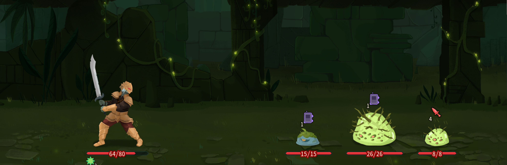
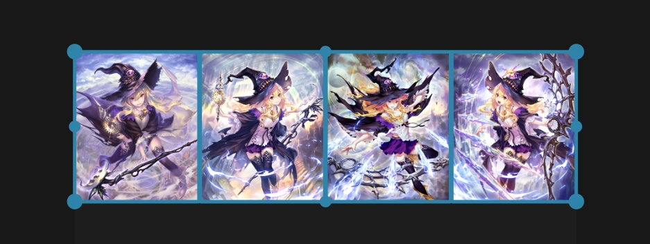
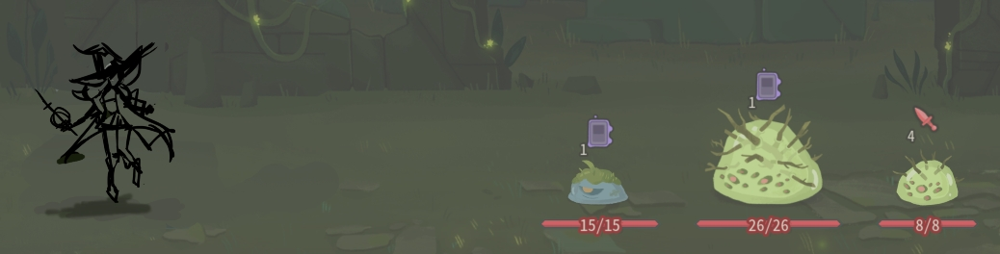
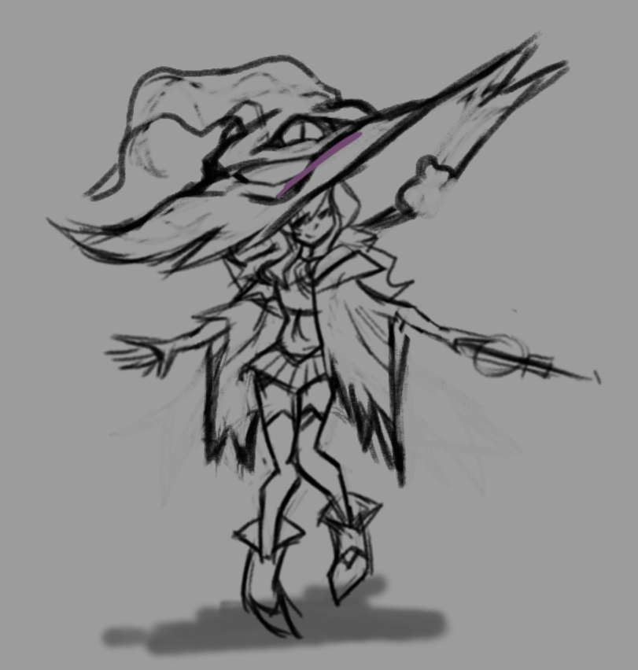
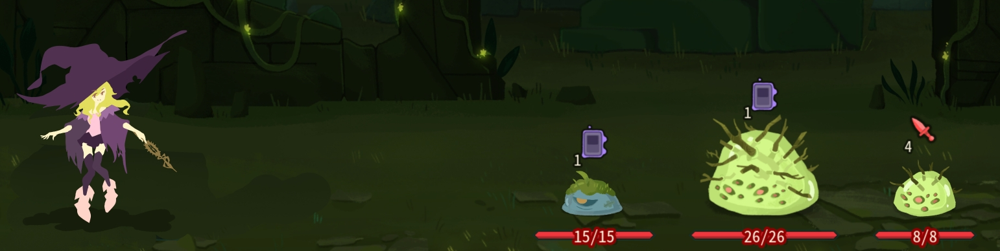
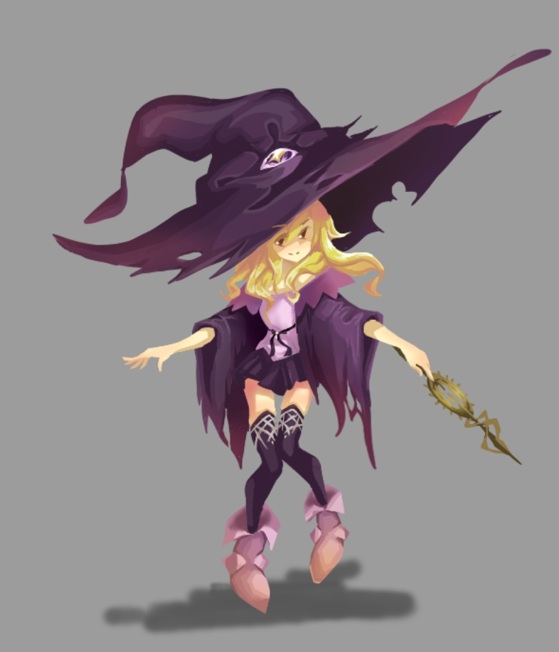

## 引言

同志们，这里时有关塔2美术资源制作的内容。
* 由于塔2还处于测试阶段，本教程会不定期进行更新。
* 本教程面向有一定美术基础，想要尝试手绘美术资产的同志。当然0基础也可以尝试，画画本身是件很快乐的事情QAQ。

## 准备工具

之前从未接触会绘画的同志们也不一定需要跳过这一章节。画画并非难事，与此相反这是个很快乐的过程。

在这里我会列一个清单，罗列一下绘制原画所需要的工具与软件。
* **绘图工具：**
	1. `数位板/笔`（最经典的板绘套装，甚至只要百元级别的配置就可以实现板绘的所有功能，并且由于是坐姿工作，对腰和颈椎很友好。）
	2. `数位屏/笔`（数位屏相较于数位板好控制的多，但是价格也更加昂贵，且便宜的数位版会有明显色差）
	3. `ipad/Apple Pencil`（ipad是最适合新手板绘的工具，无论是颜色还是操作方式都十分流畅）

	绘图工具的购买可以在b站上观看测评视频进一步了解，在这里我只做简单介绍

* **绘图软件：**
	1. `PS/PhotoShop`（最经典的绘画软件，正版价格为88元/月。使用盗版会不时强制退出，有些麻烦）
	2. `CSP`（专业板绘人士使用的软件，正版价格需一次性付费429元，功能齐全）
	3. `krita`（长期更新的绘画软件，免费开源下载，但稍有些BUG）
	4. `Procrate`（仅限ipad使用，AppStore上售价88元，简单易上手）

	*同上，软件的购买与使用也可以在b站上观看推荐视频了解。但就像使用手机一样，会使用安卓手机后，即使换成苹果手机也只需要熟悉两天就能够日常使用。所以只要学会了一个软件，就不用担心切换软件后还要从头学起。*

以上为手绘原画所需要的工具，但同时也可以通过其他方法来制作原画，列如解包文件或AI生成。所以即使不选择绘画也有很多方法进行创作。

## 塔2美术风格绘制原画绘制

* 使用ai或拥有现成解包资产的同志可以速通这一章节
* 我将使用`krita`软件绘制一张原画：

第一步是在游戏当中截屏，作为绘画时的参考。这样可以一定程度上保证画风统一，不会有太强的违和感。

同样找到一些你想要绘制角色的美术资源。在这里推荐大家使用名叫：`PureRef2.0`的参考图软件，在b站上可以找到安装方式。

将游戏内截屏的透明度调低，便可以开始勾勒草稿。这一步需要将角色与敌人之间的比例确定好

随后在草稿的基础上将人物的特征分析并画出来。

* 在塔2中我建议强化一下角色的服装，与先前的美术资源相比较，我将帽子这一元素夸张化了，同时删去了如蕾丝边与吊坠等装饰物。
* 二次元角色的发型很重要，五官反倒是次要的。（就好比远处走来一个人，你会根据他的高矮，胖瘦，穿什么衣服来判断他是谁。而非第一时间注意脸长什么样子）
* 不需要绘制太多明显的线条。塔2的美术风格偏向美式卡通画风，以色块为主。过多的线条反而会妨碍你后续的创作过程

像这样直接大胆的将色块分割好，透视和比例可以可以有些变形，这样更能与塔2的漫画风格适配

最后就是不断的用色块切分阴影和亮部，将体积感区分开后稍微增添细节就可以了。

## 注意事项

* 角色的衣物不应该穿着的太多（字面意思，别想歪了）。因为后续需要对原画进行拆解绑定制作动画。而衣服与头发需要使用物理模拟，过多的毛发与过长的衣物会消耗大量精力进行调试。
* 所以说设计角色可以搞一些紧身衣或者是机甲风格
* 绘画过程中不要太专注于绘制光影，塔2的游戏内很少有强烈的光影关系，明暗对比强烈反倒会产生违和感。